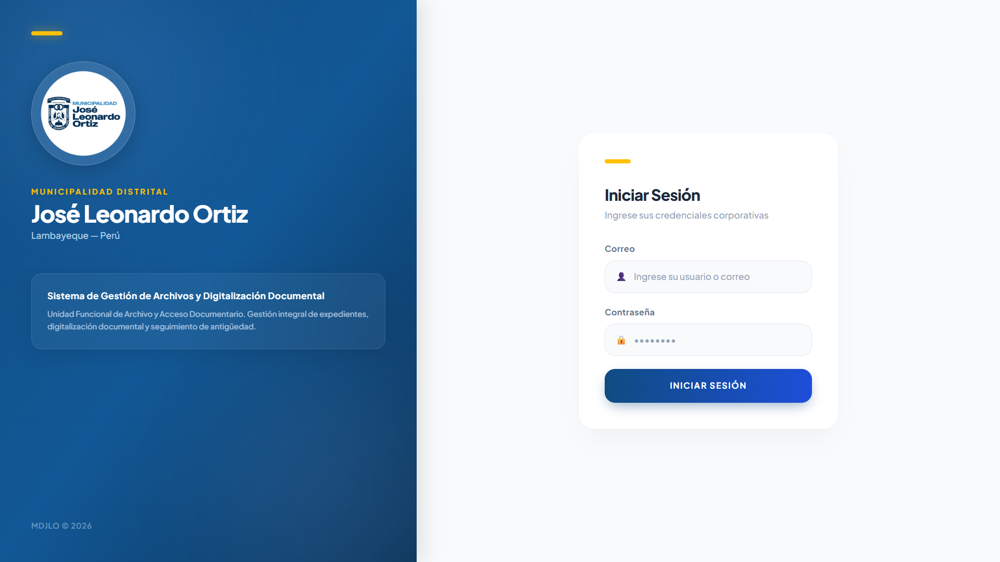

# **🏛️ Sistema Integrado de Gestión y Digitalización de Archivos**

### **Unidad Funcional de Archivo y Acceso Documentario - Municipalidad Distrital de José Leonardo Ortiz**

Esta plataforma de alto rendimiento ha sido diseñada y desarrollada para **automatizar, auditar y modernizar el ciclo de vida documental** de la MDJLO. El sistema impulsa directamente la política institucional de **"Cero Papel"** y la Ley de Gobierno Digital, transformando el acervo físico en un ecosistema de datos indexados y seguros.

El sistema emplea una **arquitectura desacoplada (Frontend React + Backend Laravel)** protección estricta en el manejo de la información y una experiencia de usuario fluida e intuitiva capaz de procesar miles de expedientes.

---

## **🚀 Módulos y Características**

### **1.🛡️ Autenticación y Seguridad:**

- **Control de acceso:** Basado en tokens para el personal autorizado del área de Archivo.

### **2. 📂 Gestión Documental Core y Búsqueda Inteligente**

- **Registro Unificado:** Creación, actualización y seguimiento de expedientes físicos con tipología documental adaptable.
- **Combobox Multicampo:** Selector desplegable capaz de buscar entre miles de registros de forma instantánea filtrando por número de expediente, título o área de origen.
- **Validación Visual Estricta:** El sistema reemplaza las clásicas y molestas alertas del navegador por un ecosistema de validación visual que impide registrar información incompleta, garantizando la integridad de la base de datos municipal.

### **3. 📑 Digitalización Segura y Auditoría de Archivos**

- **Smart Dropzone:** Interfaz de arrastrar y soltar con candado de seguridad dinámico (se bloquea automáticamente si no hay un expediente asignado).
- **Auditoría de Folios:** El sistema lee la estructura interna de los documentos PDF desde el navegador del usuario **antes de subirlos al servidor**. Si las páginas físicas del PDF no coinciden con los folios registrados en el sistema, la carga se aborta automáticamente por seguridad.
- **Aislamiento de Rutas:** Almacenamiento seguro (`Storage` enlazado) para proteger el acervo institucional de accesos directos no autorizados.

### **4. 📊 Dashboard Analítico y KPIs en Tiempo Real**

- **Gráficos Institucionales Escalables:** Paneles de carga documentaria horizontales que previenen el amontonamiento visual de datos, destacando automáticamente en dorado el área municipal líder.
- **Línea de Tiempo Aislada:** Historial inteligente de actividad reciente que diferencia un registro nuevo, una actualización de texto o una subida de PDF en hilos cronológicos independientes.

### **5. ⏱️ Motor de Vigencia Documental y Auditoría**

- **Semaforización Automática:** Procesamiento y cálculo de fechas de retención que clasifica los documentos en tiempo real como: _Conservar_ (Verde), _En Revisión_ (Ámbar) y _Para Depurar_ (Rojo).
- **Consola de Auditoría Inmutable:** Registro tipo "Caja Negra" que rastrea automáticamente qué usuario, cuándo, a qué hora y qué campo específico modificó en un expediente.

---

## **🛠️ Arquitectura y Stack Tecnológico**

**Frontend (Interfaz de Usuario / Cliente):**

- **Framework Principal:** React.js (Componentes Funcionales y Hooks)
- **Empaquetador:** Vite (Rendimiento optimizado y Hot Module Replacement)
- **Estilos y UI:** Tailwind CSS (Diseño responsivo, Glassmorphism y utilidades a medida)
- **Gestión de PDFs en Cliente:** `pdf-lib` (Procesamiento y lectura binaria de PDFs)
- **Peticiones HTTP:** Axios

**Backend (API REST / Servidor):**

- **Framework:** Laravel 11.x (PHP 8.2+)
- **Autenticación:** Laravel Sanctum (Token-based Auth)
- **Base de Datos:** MySQL / MariaDB (Optimización de llaves foráneas y borrado en cascada)

---

## **⚙️ Requisitos Previos para Despliegue Local**

Para montar y compilar el sistema completo en cualquier equipo, se requiere:

- **Node.js:** Versión LTS (Incluye el gestor de paquetes `npm`).
- **PHP:** Versión 8.2 o superior.
- **Composer:** Gestor de dependencias de PHP.
- **Servidor Web Local:** Laragon o XAMPP.

---

## **💾 Paso 1: Configuración de la Base de Datos**

El proyecto incluye un script en la carpeta `/database` llamado `archivo_mdjlo.sql` que contiene la estructura optimizada y los catálogos maestros precargados.

### **Si utiliza Laragon:**

1. Abra **Laragon** y dale clic a **"Iniciar todo"**.
2. Dale clic al botón **"Base de datos"** para abrir _HeidiSQL_.
3. Conéctate a tu sesión local (`localhost` - Usuario: `root`, sin contraseña).
4. Dale clic derecho sobre tu conexión en la barra lateral y selecciona **"Crear nueva" -> "Base de datos"**. Nómbrela exactamente: `archivo_mdjlo`.
5. Selecciona la base de datos recién creada, ve al menú superior: **Archivo -> Ejecutar archivo SQL...**
6. Busca y selecciona el archivo `archivo_mdjlo.sql` de este proyecto y dale a abrir para montar las tablas.

> ⚠️ **Nota:** Si sale una advertencia durante la importación, abre el archivo `archivo_mdjlo.sql` en un editor de texto, copia todo el contenido, pégalo en una pestaña de "Consulta" en HeidiSQL y ejecútalo manualmente.

### **Si utiliza XAMPP:**

1. Abre el **XAMPP Control Panel** e inicia los módulos **Apache** y **MySQL**.
2. En tu navegador, ingresa a: `http://localhost/phpmyadmin`.
3. En la barra lateral izquierda, dale clic a **"Nueva"** y crea una base de datos llamada: `archivo_mdjlo` (cotejamiento: `utf8mb4_general_ci`).
4. Selecciona la base de datos creada, ve a la pestaña **"Importar"** en el menú superior.
5. Dale clic a **"Seleccionar archivo"**, busca el archivo `archivo_mdjlo.sql` y dale al botón **"Importar"** al final de la página.

---

## **🔧 Paso 2: Instalación del Backend (API Laravel)**

1. Abre tu terminal **(CMD o PowerShell)** y navega hasta la carpeta del **backend**:

```bash
cd backend-archivo
```

2. Instale el núcleo del framework y sus dependencias:

```bash
composer install
```

3. Clone el archivo de entorno base:

```bash
# En Windows:
cmd /c "copy .env.example .env"
# En Mac/Linux:
cp .env.example .env
```

4. Abra el archivo `.env` en su editor y configure la conexión a su motor de base de datos:

```bash
DB_CONNECTION=mysql
DB_HOST=127.0.0.1
DB_PORT=3306
DB_DATABASE=archivo_mdjlo
DB_USERNAME=root
DB_PASSWORD=
```

5. Genere la llave criptográfica para encriptar tokens y contraseñas:

```bash
php artisan key:generate
```

6. Genere el enlace simbólico para exponer de forma segura los PDFs almacenados hacia el Frontend:

```bash
php artisan storage:link
```

7. Crear las tablas del sistema en su base de datos local:

```bash
php artisan migrate
```

8. Encienda el servidor local:

```bash
php artisan serve
```

> **✅ El Backend estará escuchando peticiones REST en: `http://127.0.0.1:8000`**

---

## **🌐 Paso 3: Instalación del Frontend (React + Vite)**

1. Abre una **nueva ventana de la terminal** (sin cerrar la del backend) y navegue hasta el directorio del **frontend**:

```bash
cd frontend-archivo
```

2. Instale los módulos de **React, Vite, Tailwind y la librería de procesamiento de PDFs** especificadas en el proyecto:

```bash
npm install
```

> 🛑 **Solución de errores:** Si al ejecutar `npm install` te sale un error rojo diciendo que **"la ejecución de scripts está deshabilitada (SecurityError/UnauthorizedAccess)"**, haz lo siguiente:

- Ve al menú inicio de Windows, busca PowerShell, dale clic derecho y selecciona **"Ejecutar como administrador"**.

- Pega este comando y presiona Enter: `Set-ExecutionPolicy RemoteSigned -Scope CurrentUser`.

- Escribe **S** (o Y) para confirmar y presiona Enter.

- Cierra esa ventana, reinicia tu terminal en VS Code y vuelve a intentar `npm install`.

3. Verifica que el archivo `src/services/api.js` apunte al puerto correcto de Laravel:

```bash
import axios from 'axios';

const api = axios.create({
  baseURL: 'http://127.0.0.1:8000/api', // <-- Apuntando a su Laragon/XAMPP
  headers: {
    'Content-Type': 'application/json',
    'Accept': 'application/json'
  }
});

export default api;
```

4. Levante la interfaz gráfica **ejecutando** el compilador de Vite:

```bash
npm run dev
```

> **✅ El sistema compilará los módulos y le entregará el enlace local.**

---

## **🚀 ¡Listo para Usar!**

Ingrese la URL en su navegador e ingrese a `http://localhost:5173`:


**🔑 Credenciales de Acceso Estándar:**

**Correo:** `admin@jlo.gob.pe`

**Contraseña:** `password`

---

## **🧹 Mantenimiento y Purgado de Datos**

Si ha realizado múltiples pruebas y desea **limpiar el sistema a un estado de fábrica corporativo, sin ningún documento registrado** pero conservando el catálogo oficial de áreas municipales y los tipos de documentos, ejecute este script en la consola de (HeidiSQL o phpMyAdmin):

```bash
SET FOREIGN_KEY_CHECKS = 0;
TRUNCATE TABLE `historial_estados`;
TRUNCATE TABLE `historial_ediciones`;
TRUNCATE TABLE `archivos_digitales`;
TRUNCATE TABLE `expedientes`;
SET FOREIGN_KEY_CHECKS = 1;
```

> Esto reiniciará los contadores (`AUTO_INCREMENT`) para que el próximo documento físico que registres en la Municipalidad de JLO vuelva a iniciar desde el **ID #1**.
> 💡 Nota Importante: Para completar la limpieza, debe dirigirse a la carpeta backend-archivo/storage/app/public/expedientes y borrar todas las carpetas numéricas en su interior. Esto liberará el espacio en el disco duro del servidor local.

---

## **📤 Cómo Exportar la Base de Datos Limpia**

Si deseas exportar un nuevo script `.sql` totalmente limpio (sin datos) para empaquetar el proyecto final, sigue estos pasos:

### **Si usas Laragon:**

1. Abre **Laragon** y haz clic en el botón **"Base de datos"** para ingresar a HeidiSQL.
2. Antes de exportar, ve a la pestaña **"Consulta" (Query)** y ejecuta el script de limpieza (`TRUNCATE`) detallado en la sección de **Mantenimiento** de este README para vaciar las tablas de transacciones.
3. En la barra lateral izquierda, haz clic derecho sobre la base de datos `archivo_mdjlo` y selecciona **"Exportar base de datos como SQL".**
4. Configura las siguientes opciones de forma estricta:
   - **Bases de datos / Tablas:** Asegúrate de que `archivo_mdjlo` y todas sus tablas internas tengan el check activado.
   - **Bases de datos:** Marca las casillas **"Suprimir"** y **"Crear"**.
   - **Tablas:** Marca las casillas **"Suprimir"** y **"Crear"**.
   - **Datos:** Selecciona la opción **"Insertar"**. _(Al haber vaciado previamente las tablas transaccionales, esta opción solo exportará la data fija de las tablas `areas`, `tipos_documento` y `usuarios`, dejando los expedientes en cero)._
   - **Salida:** Selecciona **"Archivo .sql individual"**.
   - **Nombre de archivo:** Haz clic en el ícono de la carpeta amarilla, navega hasta la carpeta `/database` del proyecto y guárdalo como `archivo_mdjlo`.
5. Haz clic en el botón **"Exportar"** ubicado en la parte inferior.

### **Si usas XAMPP:**

1. Abre el panel de control de XAMPP e inicia **Apache** y **MySQL**.
2. Ingresa a `http://localhost/phpmyadmin` en tu navegador y selecciona la base de datos `archivo_mdjlo` en la barra lateral izquierda.
3. Ve a la pestaña **"SQL"** en el menú superior, pega el script de limpieza (`TRUNCATE`) que está en la sección de _Mantenimiento_ de este README y ejecútalo para limpiar los datos.
4. Una vez limpia, haz clic en la pestaña **"Exportar"** del menú superior.
5. En **"Método de exportación"**, selecciona la opción **"Personalizado: mostrar todas las opciones posibles"**.
6. En la sección **"Estructura y datos"**, valida lo siguiente:
   - En las opciones de **Estructura**, marca la casilla **"Añadir la instrucción DROP TABLE / VIEW / PROCEDURE / FUNCTION / EVENT / TRIGGER"** _(esto garantiza que el script reemplace versiones antiguas en el destino)_.
   - En las opciones de **Datos**, asegúrate de que esté configurado en **"insert"**.
7. Desplázate hasta el final de la página y haz clic en el botón **"Exportar"**. Guarda el archivo descargado en la carpeta `database/` del proyecto.

---

## **📦 Guía para Compartir / Empaquetar el Proyecto**

Si necesitas pasar este sistema a otro desarrollador, al ingeniero a cargo o la nube, sigue estas buenas prácticas:

### **Compartir por .ZIP o .RAR:**

1. Antes de comprimir el proyecto, entra a la carpeta `frontend-archivo` y elimina la carpeta `node_modules`.
2. Entra a la carpeta `backend-archivo` y elimina la carpeta `vendor` y el archivo `.env`.
3. Estas carpetas pesan cientos de megabytes y no deben enviarse. El usuario final las regenerará automáticamente al ejecutar los comandos de instalación detallados en este manual.
4. Asegúrate de incluir tu script `.sql` dentro de la carpeta `database/`.
5. Comprime la carpeta raíz en un `.zip` o `.rar` y listo.

### **Subir a tu repositorio único de GitHub (Monorepo):**

1. Para trabajar bajo el enfoque Monorepo, nos pararemos en la **carpeta raíz general** (donde se ven las carpetas `backend-archivo` y `frontend-archivos` juntas). Crearemos un `.gitignore` maestro en esa misma raíz con el siguiente contenido para asegurar que se respeten las exclusiones internas de cada entorno:

```bash
# Dependencias de Node (Frontend)
**/node_modules/
**/dist/

# Dependencias de PHP / Laravel (Backend)
**/vendor/
**/.env
**/storage/*.key
**/bootstrap/cache/
```

2. Base de Datos en GitHub: **SÍ SE SUBE** el archivo `archivo_mdjlo.sql` limpio (solo estructura y datos maestros como áreas y usuarios de prueba). **NUNCA SE SUBE** un volcado SQL que contenga datos reales de expedientes o documentos confidenciales de la municipalidad por cumplimiento estricto de la **Ley N° 29733 (Ley de Protección de Datos Personales en el Perú)**. Asegúrese de aplicar el script de mantenimiento (`TRUNCATE`) detallado arriba antes de realizar su exportación final.
3. Para realizar la **primera subida absoluta** del proyecto completo, abra su terminal **(CMD o PowerShell)** parada estrictamente en la carpeta raíz general y ejecute los siguientes comandos paso a paso:

a. Inicializar el contenedor de Git en la raíz general del proyecto

```bash
git init
```

b. Rastrear y preparar todos los archivos del sistema (Git viajará a cada carpeta, leerá sus respectivos .gitignore y filtrará la basura automáticamente)

```bash
git add .
```

c. Empaquetar y confirmar los archivos localmente con un mensaje descriptivo

```bash
git commit -m "feat: estructura inicial limpia del sistema de archivos mdjlo"
```

d. Renombrar la rama principal bajo el estándar moderno

```bash
git branch -M main
```

e. Vincular tu computadora con el repositorio en la nube (Crea un repositorio vacío en tu cuenta de GitHub y pega tu URL)

```bash
git remote add origin https://github.com/TU_USUARIO_DE_GITHUB/TU_REPOSITORIO.git
```

f. Empujar todo el código de manera definitiva a la rama principal de GitHub

```bash
git push -u origin main
```

---

> 💡 Tip de mantenimiento rápido:
> Si haces un cambio o mejora de último minuto en los controladores o en las validaciones de los modales en el frontend, solo ejecutas estos tres comandos en la carpeta correspondiente para actualizar la nube:

````bash
git add .
git commit -m "fix: ajuste en las alertas de confirmacion visual"
git push
```bash
````
